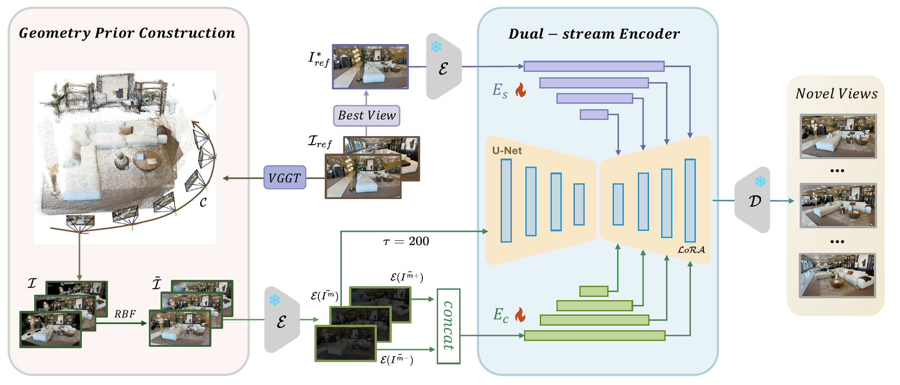

# DuoDiff: Dual-Stream Encoder-Guided One-Step Diffusion for Novel View Synthesis

[](https://pytorch.org/)
[](https://www.python.org/)
[](https://developer.nvidia.com/cuda-toolkit)
[](#license)

This is the official implementation (README) for the paper **DuoDiff: Dual-Stream Encoder-Guided One-Step Diffusion for Novel View Synthesis**.  

---

## Highlights

- **One-step diffusion for efficient NVS**: DuoDiff performs novel view synthesis with a **single denoising step**, targeting fast inference while maintaining high visual fidelity.   
- **Continuous geometric prior**: a point-cloud projection prior is densified via **RBF interpolation**, reducing holes and projection noise to better stabilize geometry. 
- **Dual-stream decoupling (Structure / Content)** to alleviate geometry–texture conflict in one-step generation:  
  - **Structure encoder** leverages **neighboring-view complementarity** to handle occlusions and geometric ambiguity. 
  - **Content encoder** performs **dynamic view selection** (based on pose/optical-axis similarity) to preserve fine texture and prevent style drift.
 
<p align="center">
  

  <em>Figure 1: DuoDiff generates high-fidelity novel views under sparse inputs and large viewpoint changes.</em>
</p>
<p align="center">
  

  <em>Figure 2: 3D reconstruction results from synthesized novel views on the DL3DV test set.</em>
</p>


---

## Table of Contents
- [Overall Framework](#overall-framework)
- [Environment Setup](#environment-setup)
- [Data Preparation](#data-preparation)
- [Quick Start: Training & Evaluation](#quick-start-training--evaluation)


---

## Overall Framework

DuoDiff formulates NVS as **conditional one-step diffusion** guided by a **continuous geometry prior** and **dual-stream encoder features**:
<p align="center">
  
</p>

1. **Geometry Prior Construction**
   - Reconstruct a sparse point cloud and camera parameters (e.g., via a dense geometry predictor).
   - Project point cloud to target view(s) to obtain geometric projections.
   - Apply **RBF-based densification** to produce a continuous dense prior for more complete and stable geometry guidance. :contentReference[oaicite:7]{index=7}  

2. **Dual-Stream Encoder Guidance**
   - **Structure Encoder (Es):** encodes co-visibility cues from neighboring projected views to improve occlusion handling and cross-view consistency. :contentReference[oaicite:8]{index=8}  
   - **Content Encoder (Ec):** selects the best reference view according to angular deviation and extracts semantic/texture guidance to reduce texture drift. :contentReference[oaicite:9]{index=9}  

3. **One-Step Diffusion with Conditional Injection**
   - Multi-scale features are fused and injected into the SD-Turbo U-Net decoder using **Zero-Convolution residual blocks** and **LoRA** fine-tuning for one-step generation. :contentReference[oaicite:10]{index=10}  

<p align="center">
  <!-- Replace with your method figure -->
  <!--  -->
  <em>Overall framework: geometry prior + dual-stream encoders + one-step diffusion injection.</em>
</p>

---

## Environment Setup

> **Note**: This repository section is provided as a standard template for reproduction. Please adjust versions to your local setup and the actual released codebase.

We recommend a CUDA-capable GPU and the following environment:
- **OS**: Ubuntu 22.04
- **Python**: 3.9+
- **PyTorch**: 2.4.1+cu124

### Installation

1. **Clone this repository**
```bash
git clone https://github.com/23DuoYun/DuoDiff.git
cd DuoDiff
conda create -n duodiff python=3.9 -y
conda activate duodiff
pip install -r requirements.txt
```


## Data Preparation
Train on **DL3DV**.

DuoDiff requires a **2D geometric prior** constructed from multi-view images. We use **VGGT** to reconstruct scene geometry (e.g., point cloud / depth + camera poses) and then **reproject** the reconstructed geometry back to each target view to obtain **2D geometry projections** (used as geometry guidance). These projections are further densified in our pipeline to form a continuous geometric prior (see paper for details).

Please download DL3DV following its official instructions, then organize it as:

```bash
bash 3d_2d.sh
```

## Quick Start: Training & Evaluation

We provide simple scripts to start the training and evaluation process.

### Training

Use the following command to start a training task :

```bash
bash train.sh
```


### Evaluation

Use the following command to evaluate a pre-trained model on the
```bash
python demo.py
```
